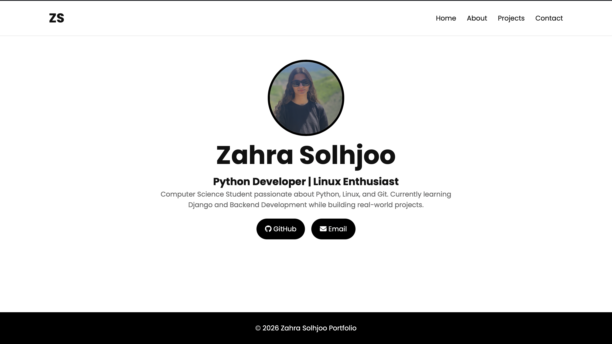
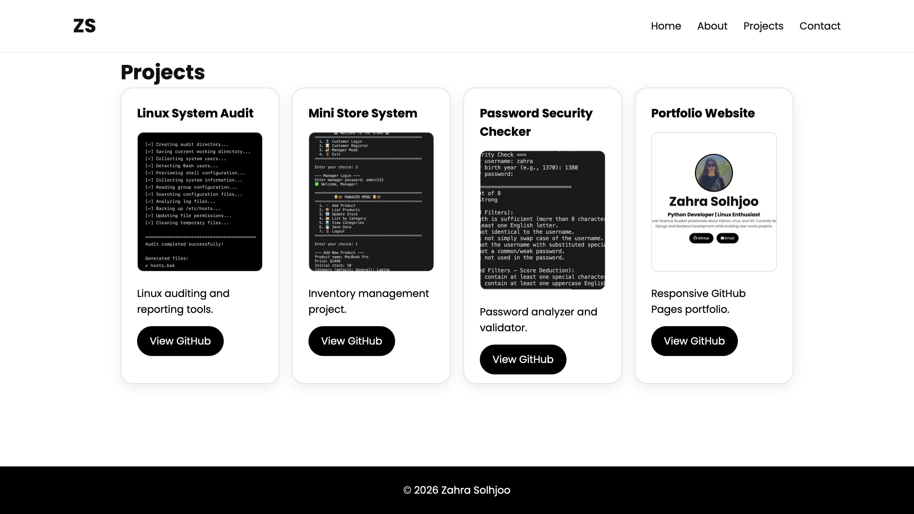
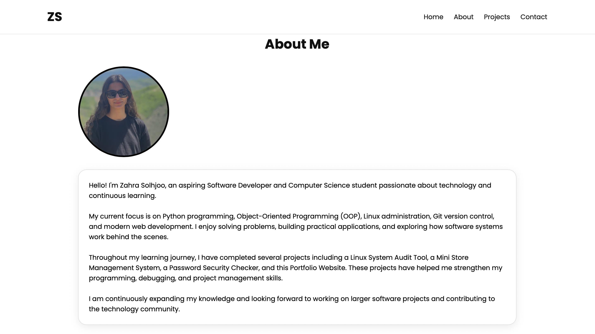
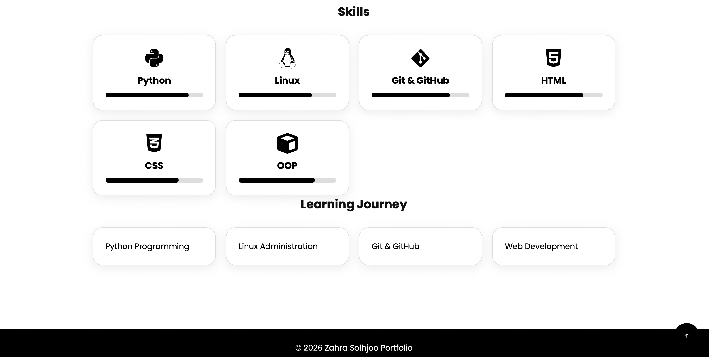
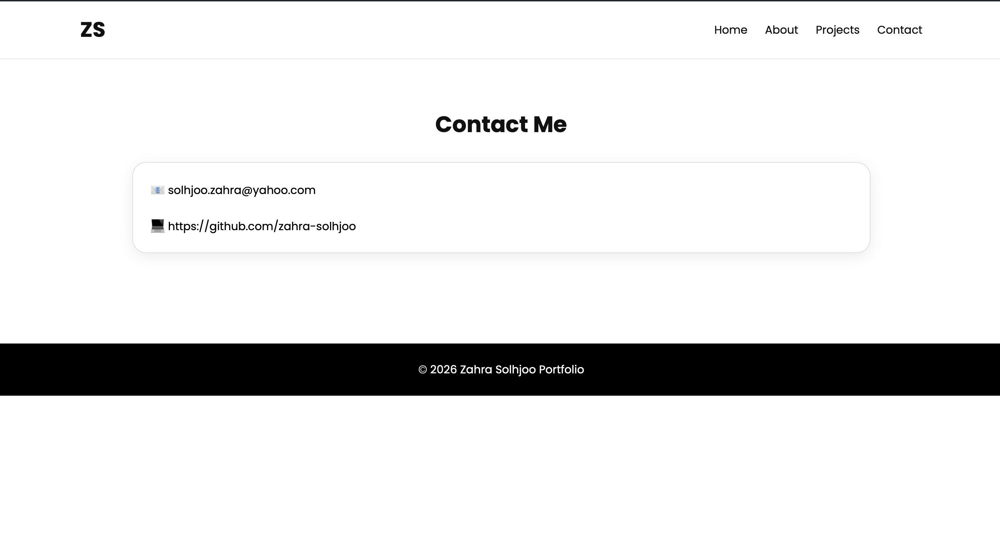

# 🌐 Personal Portfolio Website

A responsive personal portfolio website built with **HTML, CSS, and JavaScript** to showcase my skills, projects, and contact information.

## 📸 Preview

This website includes:

- 🏠 Home
- 👤 About Me
- 💻 Projects
- 📬 Contact

## 🚀 Features

- Responsive design for desktop, tablet, and mobile
- Modern and clean user interface
- Smooth scrolling and interactive elements
- Project showcase with GitHub repository links
- Profile section with personal information
- Contact section with social links

## 🛠️ Technologies Used

- HTML5
- CSS3
- JavaScript
- Git
- GitHub Pages

## 📸 Screenshots

<p align="center">
  
  
</p>

<p align="center">
  
  
  
</p>

## 📂 Project Structure

```
portfolio/
│
├── index.html
├── about.html
├── projects.html
├── contact.html
│
├── css/
│   └── style.css
│
├── js/
│   └── script.js
│
└── images/
```

## 📁 Featured Projects

- 🔹 Linux System Audit
- 🔹 Mini Store System
- 🔹 Password Security Checker

## 🌍 Live Demo

👉 [https://zahra-solhjoo.github.io/web.portfolio/](https://zahra-solhjoo.github.io/portfolio/)

## 👩‍💻 Author

**Zahra Solhjoo**

GitHub:
https://github.com/zahra-solhjoo

---

⭐ If you like this project, don't forget to leave a star.
